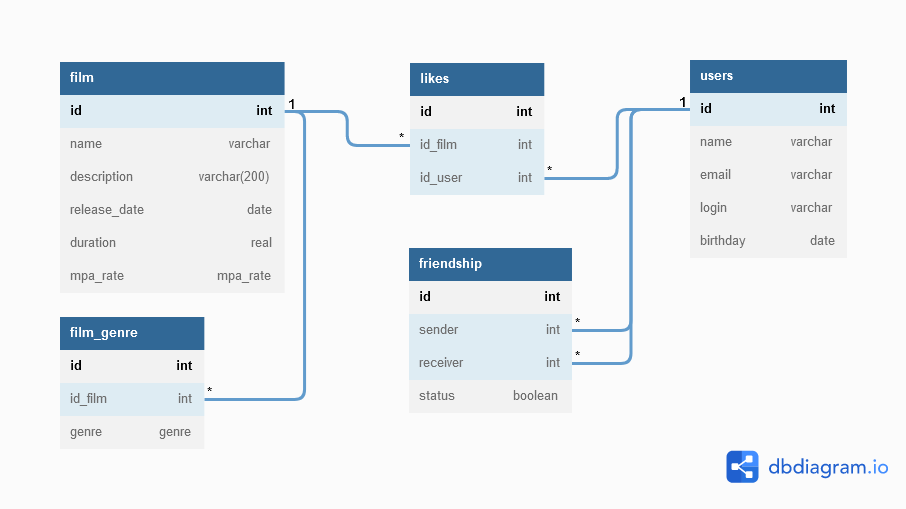

# java-filmorate
Template repository for Filmorate project.

CRUD-операции

SELECT * FROM users; -- получить всех User

INSERT INTO users (id, name, email, login, birthday) VALUES (...); --добавление User

UPDATE users SET name = ... WHERE id = ... ; --обновление User

DELETE FROM users WHERE id = ...; --удаление User

SELECT * FROM users WHERE id = ... ; -- получение User по id

SELECT * FROM film; -- получить все Film

INSERT INTO film (id, name, description, release_date, duration, mpa_rate) VALUES (...); --добавление Film

UPDATE film SET name = ... WHERE id = ... ; --обновление Film

DELETE FROM film WHERE id = ...; --удаление Film

SELECT * FROM film WHERE id = ... ; -- получение Film по id

INSERT INTO friendship (sender, receiver, status) VALUES (...); -- отправить запрос на дружбу

UPDATE friendship SET status = ... ; - подтверждение добавления в друзья \ удаление из друзей получателем запроса на дружбу

DELETE FROM friendship WHERE sender IN (...) AND receiver IN (...); -- отправитель запроса на дружбу удаляет друга (((:

SELECT sender FROM friendship WHERE receiver = ... AND status = true UNION SELECT receiver FROM friendship WHERE sender = ... ; -- получение списка друзей User

SELECT sender FROM friendship WHERE receiver = ... AND status = true; -- получение списка друзей User (когда User одобрил запрос)

SELECT receiver FROM friendship WHERE sender = ... ; -- получение списка друзей User (когда User отправил запрос)

INSERT INTO likes (id_film, id_user) VALUES (...); -- User ставит like Film

DELETE FROM likes WHERE id_film = ... AND id_user = ...; --User удаляет like для Film

SELECT id_film, COUNT (id_film) FROM likes GROUP BY id_film ORDER BY count DESC FETCH FIRST ... ROW ONLY; -- получение списка Film с количеством лайков отсортированных по убыванию лайков и ограничением количества
